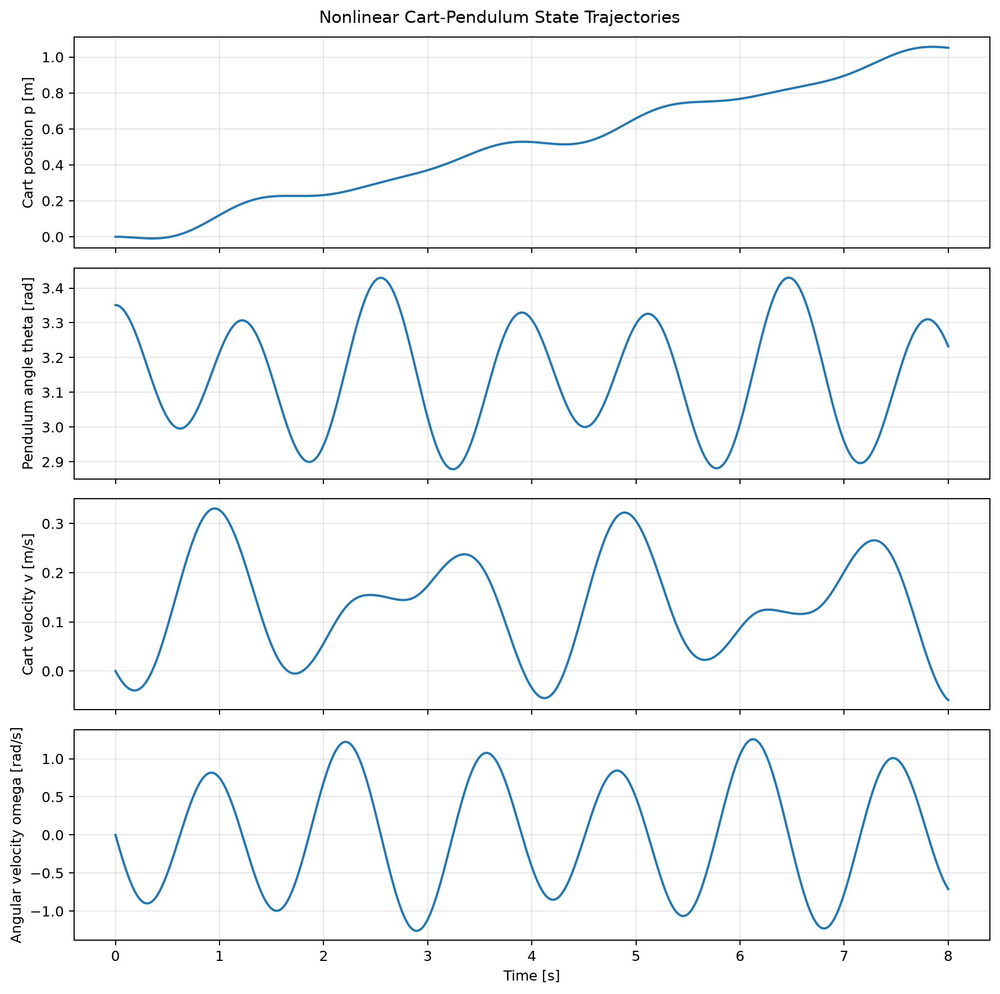
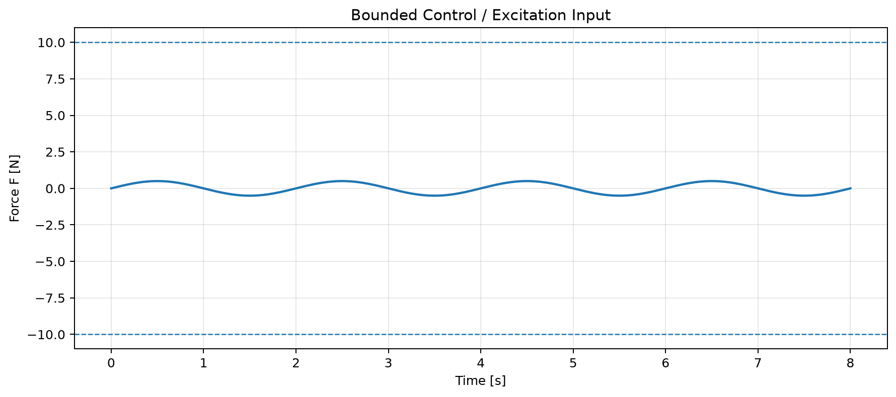

# Cart-Pendulum Optimal Control Benchmark

A Python benchmark for nonlinear cart-pendulum dynamics, numerical simulation, and physics-based model verification. The repository provides a common plant and simulation layer that can be reused when comparing optimal-control methods such as direct single shooting, direct multiple shooting, iLQR, direct collocation, and model predictive control.

The current version focuses on the part that every controller depends on: a verified nonlinear plant model, reproducible forward integration, automated physics tests, and a baseline simulation that generates state and control trajectories.

## Current implementation

This repository currently includes:

- nonlinear cart-pendulum equations of motion;
- a fixed-step fourth-order Runge-Kutta (RK4) simulator;
- a SciPy `solve_ivp` simulation interface;
- equilibrium tests for both upright and hanging configurations;
- an unforced mechanical-energy conservation test;
- parameter validation for nonphysical masses and lengths;
- a reproducible simulation script that saves state and control plots.

Optimal-control solvers are intentionally not included in this first milestone. They can be added on top of the same plant and simulator so that future methods are compared using identical dynamics and numerical assumptions.

## System definition

The state vector is

$$
\mathbf{x}
=
\begin{bmatrix}
p \\
\theta \\
v \\
\omega
\end{bmatrix}
\in \mathbb{R}^{4},
\tag{1}
$$

where:

- $p$ is cart position in meters;
- $\theta$ is pendulum angle in radians;
- $v$ is cart velocity in meters per second;
- $\omega$ is pendulum angular velocity in radians per second.

The angle convention used throughout the repository is

$$
\theta = 0
\quad \Longrightarrow \quad
\text{upright equilibrium},
\tag{2}
$$

and

$$
\theta = \pi
\quad \Longrightarrow \quad
\text{hanging equilibrium}.
\tag{3}
$$

The control input is the horizontal cart force

$$
\mathbf{u}
=
\begin{bmatrix}
F
\end{bmatrix}
\in \mathbb{R}.
\tag{4}
$$

For cart mass $M$, pendulum mass $m$, pendulum length $L$, and gravitational acceleration $g$, define

$$
D(\theta)
=
M+m\sin^{2}\theta.
\tag{5}
$$

The nonlinear cart acceleration is

$$
\ddot{p}
=
\frac{
F
+m\sin\theta
\left(
L\omega^{2}-g\cos\theta
\right)
}{
M+m\sin^{2}\theta
}.
\tag{6}
$$

The nonlinear pendulum angular acceleration is

$$
\ddot{\theta}
=
\frac{
(M+m)g\sin\theta
-F\cos\theta
-mL\omega^{2}\sin\theta\cos\theta
}{
L\left(M+m\sin^{2}\theta\right)
}.
\tag{7}
$$

The continuous-time state equation is therefore

$$
\dot{\mathbf{x}}
=
\begin{bmatrix}
v \\
\omega \\
\ddot{p} \\
\ddot{\theta}
\end{bmatrix}
=
\mathbf{f}(\mathbf{x},\mathbf{u}).
\tag{8}
$$

## Repository structure

```text
optimal-control/
├── README.md
├── requirements.txt
├── src/
│   ├── __init__.py
│   ├── plant.py
│   └── simulator.py
├── tests/
│   ├── __init__.py
│   └── test_plant.py
├── scripts/
│   └── run_simulation.py
└── outputs/
```

### `src/plant.py`

Implements the nonlinear plant model and total mechanical-energy calculation.

### `src/simulator.py`

Provides two forward-integration methods:

- deterministic fixed-step RK4;
- SciPy `solve_ivp` using adaptive RK45 integration.

### `tests/test_plant.py`

Checks the physical behavior of the model rather than only checking that functions execute. The tests verify both equilibria, unforced energy conservation, and invalid-parameter rejection.

### `scripts/run_simulation.py`

Runs a bounded open-loop excitation experiment, integrates the nonlinear dynamics, prints basic diagnostics, and saves state and control trajectories to the `outputs/` directory.

## Installation

### Windows PowerShell or Command Prompt

Clone or download the repository, then open a terminal in the repository root:

```powershell
cd path\to\optimal-control
```

Create a virtual environment:

```powershell
python -m venv .venv
```

Activate it:

```powershell
.venv\Scripts\activate
```

Upgrade `pip`:

```powershell
python -m pip install --upgrade pip
```

Install the dependencies:

```powershell
pip install -r requirements.txt
```

### macOS or Linux

```bash
cd path/to/optimal-control
python3 -m venv .venv
source .venv/bin/activate
python -m pip install --upgrade pip
pip install -r requirements.txt
```

## Run the automated tests

From the repository root, run

```powershell
pytest -q
```

A successful run should report all tests passing.

The current test suite verifies:

- zero state derivative at the upright equilibrium;
- zero state derivative at the hanging equilibrium;
- near-conservation of total mechanical energy for the ideal unforced plant;
- rejection of zero or negative physical parameters.

## Run the baseline simulation

Run

```powershell
python scripts/run_simulation.py
```

The script saves

```text
outputs/state_trajectories.png
outputs/control_effort.png
```

To save the figures and also display them interactively, run

```powershell
python scripts/run_simulation.py --show
```

The state-trajectory figure contains:

- cart position $p(t)$;
- pendulum angle $\theta(t)$;
- cart velocity $v(t)$;
- pendulum angular velocity $\omega(t)$.

The control figure shows the applied horizontal force $F(t)$.

## Example output

Running the baseline simulation produces the following figures:





These plots are generated from the same executable script used in the local verification workflow, so the figures in the repository can be reproduced rather than treated as static illustrations.

## Numerical integration

The fixed-step simulator uses classical fourth-order Runge-Kutta integration. For a system

$$
\dot{\mathbf{x}}
=
\mathbf{f}(t,\mathbf{x},\mathbf{u}),
\tag{9}
$$

with integration step $h$, the RK4 stages are

$$
\mathbf{k}_{1}
=
\mathbf{f}
\left(
t_k,
\mathbf{x}_k,
\mathbf{u}_k
\right),
\tag{10}
$$

$$
\mathbf{k}_{2}
=
\mathbf{f}
\left(
t_k+\frac{h}{2},
\mathbf{x}_k+\frac{h}{2}\mathbf{k}_{1},
\mathbf{u}_k
\right),
\tag{11}
$$

$$
\mathbf{k}_{3}
=
\mathbf{f}
\left(
t_k+\frac{h}{2},
\mathbf{x}_k+\frac{h}{2}\mathbf{k}_{2},
\mathbf{u}_k
\right),
\tag{12}
$$

and

$$
\mathbf{k}_{4}
=
\mathbf{f}
\left(
t_k+h,
\mathbf{x}_k+h\mathbf{k}_{3},
\mathbf{u}_k
\right).
\tag{13}
$$

The state update is

$$
\mathbf{x}_{k+1}
=
\mathbf{x}_{k}
+
\frac{h}{6}
\left(
\mathbf{k}_{1}
+2\mathbf{k}_{2}
+2\mathbf{k}_{3}
+\mathbf{k}_{4}
\right).
\tag{14}
$$

The control value is held constant over each RK4 step, matching a zero-order-hold sampled-data implementation.

## Why verify the plant before adding an optimizer?

An optimal-control method can converge numerically even when the model contains an incorrect sign, inconsistent coordinate convention, or integration error. Those failures can produce convincing-looking trajectories that are physically wrong.

For that reason, this repository treats model verification as the first benchmark layer. Future controllers will reuse the same plant and integration interfaces, making differences in performance attributable to the control or optimization method rather than to different underlying models.

## Planned benchmark extensions

The next development stages are intended to add:

1. direct single-shooting trajectory optimization;
2. direct multiple-shooting trajectory optimization;
3. common state, control, and terminal cost definitions;
4. actuator and cart-track constraints;
5. swing-up and upright-stabilization benchmark cases;
6. convergence and infeasibility diagnostics;
7. comparisons of final cost, terminal error, constraint violation, iteration count, and solve time;
8. optional iLQR, direct collocation, and MPC baselines.

A future benchmark problem will use the upright target

$$
\mathbf{x}_{\mathrm{target}}
=
\begin{bmatrix}
0 \\
0 \\
0 \\
0
\end{bmatrix}.
\tag{15}
$$

The constrained trajectory-optimization problem can then be written in the form

$$
\underset{\mathbf{u}(t)}{\operatorname{minimize}}
\quad
J,
\tag{16}
$$

subject to

$$
\dot{\mathbf{x}}
=
\mathbf{f}(\mathbf{x},\mathbf{u}),
\tag{17}
$$

$$
-p_{\max}
\leq
p(t)
\leq
p_{\max},
\tag{18}
$$

and

$$
-F_{\max}
\leq
F(t)
\leq
F_{\max}.
\tag{19}
$$

## License

No license is included yet. Add the license you want to use before publishing the repository publicly, such as MIT, BSD-3-Clause, or Apache-2.0.
